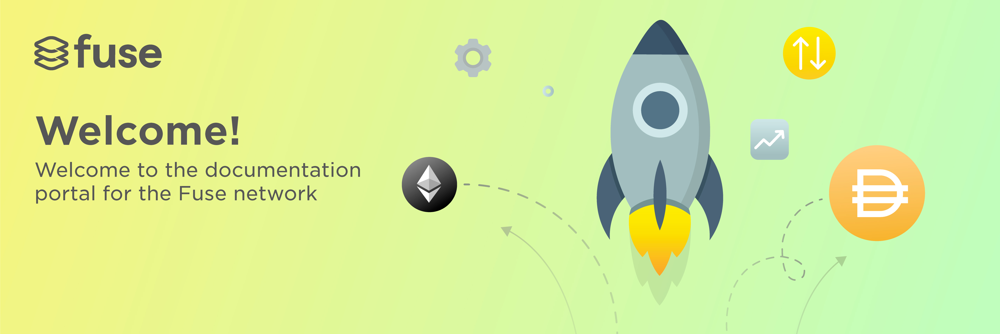

# Fuse.io

The **Fuse Network** is tailor-made for local communities and used to power day-to-day mobile payments for any person with a phone.

It’s designed to be a very low-cost alternative to traditional cash or cashless payments. It lowers the barriers of entry for entrepreneurs to launch wallets, payments services, loyalty programs, and any other systems that were previously powered by paper.

**Moving money on Fuse costs a fixed fee of** _**up to**_ **US Dollar 1 cent \(max $0.01\) per transaction.** The network is designed to have an easy to use and understandable model that is ready for mainstream adoption and far more effective than existing alternatives.

Fuse provides a new way to launch services and reach customers using mobile payments. It allows entrepreneurs to integrate everyday payments into their businesses. It reduces the cost to launch and operate non-custodial micro-finance and micro-transaction services. It leverages the powerful shared business processes that blockchains provide.

Fuse lowers the bar of entry for entrepreneurs to build powerful, effective and sustainable products. So they spend less time and money on IT, and can focus on reaching and growing their clients and customers.

You should read this if your are:

* **Non-technical** 
  * I want to launch a community on Fuse! - Go to the [_Fuse Studio documentation_](the-fuse-studio/overview.md) \_\_
  * I want to know how the network works - Go to the [_Fuse Chain overview_](the-fuse-chain/overview.md)\_\_
* **Somewhat technical** 
  * I want to be a Validator on  - Go to the [_Fuse Validator guide_](become-a-validator/how-to-become-a-validator.md)\_\_
  * I want to learn about the Wallet and it's benefits - Go to the [_Fuse Wallet overview_](fuse-services/overview.md)\_\_
* **I am a developer**
  * I want to integrate! - Go to the [_Fuse API reference_](fuse-services/api.md)\_\_
  * I want to learn about Fuse contracts - Go to the [_Fuse Chain contracts_](the-fuse-chain/consensus-contracts/)\_\_
  * Check us out on [_Github_ ](https://github.com/fuseio)


Join our [Telegram group](https://t.me/fuseio)  
Or say hello at: hello@fuse.io


