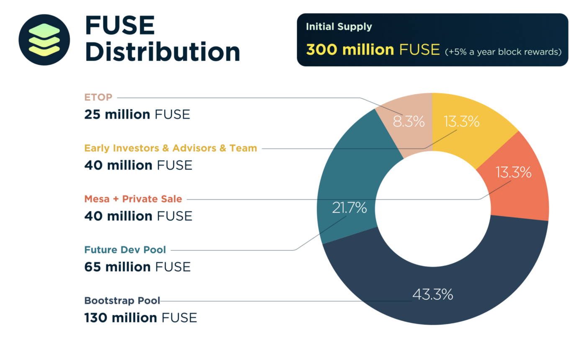
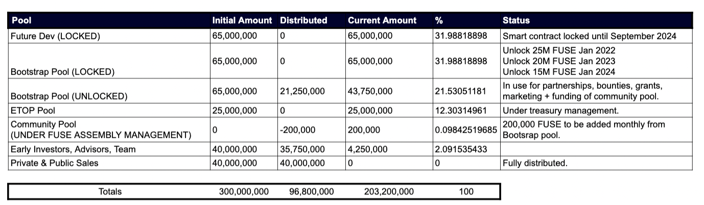

# FUSE Supply and Current Distribution

The **genesis supply** \(the amount created at the launch of the network\) of FUSE was set at 300 million. 

As of September 21, 2021, the **total supply** of FUSE stood at around 323.6 million, and the **circulating supply** at around 116.4 million. 

The figures of total and circulating supply of FUSE are constantly changing as new FUSE tokens are issued to validators and delegators and released from the initial supply components. The most reliable latest figures can be found on the Coingecko FUSE [page](https://www.coingecko.com/en/coins/fuse). 

The token distribution among various components \(pools\) at the genesis is depicted on the chart below. 

As of August 5, 2021, the distribution of the FUSE tokens issued at genesis among these components was as follows.

96,800,000 FUSE tokens had been distributed into circulation via the private and public sale, the allocations made using the unlocked portion of the Bootstrap Pool and the unlock of FUSE tokens allocated to early contributors, advisors and team. 

203.2 million FUSE remained locked or undistributed in the Future Dev pool, Bootstrap Pool and ETOP \(Employee Token Option Plan\). 

In addition to this, as of September 21, 2021, 23.6 million FUSE tokens had been created since genesis through the block reward mechanism. 

