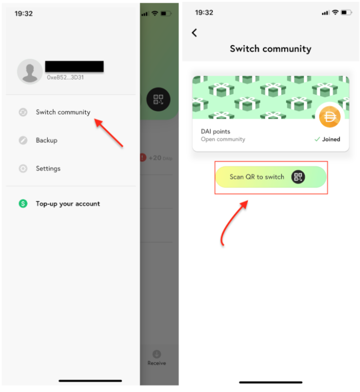

# Community Creation Tutorial

Introducing a step-by-step guide covering the community creation process on the Fuse Studio. The guide is aimed at teaching you how to __**create a new community after setting up** Metamask or Torus __and is suitable for users of all levels of technical understanding. 

## Community Creation Process

You are now ready to create a community of your own! To do so, simply go through these mini-steps of the process:

**Step 1 -** After clicking the '**launch your community**' button, put in a name and description for your community and add your email address, then click next.

**Step 2 -** Choose the **network** you want to deploy to. You have the choice to use either Ethereum mainnet or Ethereum Ropsten \(**recommended for test purposes**\).


As mentioned earlier, for test purposes, pick **Ethereum Ropsten**, then click next.


**Step 3 -** Choose between creating a **new token** \(recommended\), or use an **existing token** on Ethereum Ropsten, then click next.

**Step 4 -** Now configure your community by **customizing** the token settings. 


You can choose two different types of supplies for your token. A **Mintable/Burnable** token will allow you to create or burn tokens later on. **One time** issued tokens will have a limited supply that you will set.


This choice will essentially depend on how you wish to make use of these tokens in your community. You will also need to choose an initial supply, currency symbol, community logo, cover photo, and will be able to choose between the following currently available community plugins: 

* **Business list** — allows you to add/delete businesses in your community.
* **Join bonus** — define the amount of token’s gifted to new community members.
* **Invite bonus** — define the amount of token’s gifted to the user’s inviting new community members.
* **Backup bonus** — contract of a funder account that rewards your users for backing up their mnemonic.
* **Fiat ramp** — deposit/withdraw currency with a new feature integrated through ****[**Transak**](https://transak.com/) and ****[**Instant Ramp**](https://instant.ramp.network/) giving you more options to handle the exchange.
* **Wallet banner link** — allows you to insert an image with a link to any webpage which will be shown to all the users of your community.

**Step 5 - Review** and **sign** your community using Metamask. The verification process may take some time, so grab a cup of coffee/tea meantime.

**Step 6 -** Congratulations, you have successfully created your own, one of a kind community!

## Before Using Fuse Studio

These last couple of steps are needed to ensure the proper distribution of community balance and Fuse wallet connectivity.

**Step 7 -** Well done, you are now in full control of your community! Now, you will need to bridge over some of your **Ropsten Network balance** to the **Fuse Network balance**, allowing you to have a sufficient token balance to begin actions in the studio. 


After bridging the balance over to the Fuse Network, **switch** to the **Fuse Network custom RPC** that we created in the previous tutorial, on your Metamask or Torus to be able to perform further actions on the Studio.


**Step 8 -** It's been a long road, but you are finally on the last step! To be able to make easy mobile transactions using your community, **download the Fuse wallet app** on the [App Store](https://apps.apple.com/il/app/fuse-wallet/id1491783654) or [Google Play](https://play.google.com/store/apps/details?id=io.fuse.fusecash). 


You can also type '**Fuse wallet**' in the App Store or Google Play search to find the app.


Sign up using your **phone number** and **name** to create a wallet. On the app, click the top-left option bar and click '**Switch community**'. Then, press '**Scan QR to switch**' and navigate your phone camera to QR code that you can find in the '**White label wallet**' tab in the studio. Share this QR code with your community members so they can join too!


Press '**switch community**' and then '**Scan QR to switch**'



Use your phone camera and navigate it to the QR code


**Step 9:** Congratulations! You are set and done. Begin changing the world one Fuse community at a time!

We hope you have found this article useful and informative, and are now ready to create a community of your own! If you have any other questions regarding the Fuse network, studio, or wallet, don’t hesitate to check out the [FAQ](https://docs.fuse.io/the-fuse-studio/faq). We would love to hear your thoughts and feedback on the project and your communities on [medium](https://medium.com/fusenet), [github](https://github.com/fuseio), [twitter](https://twitter.com/fuse_network), [telegram](https://t.me/fuseio) and [discord](https://discord.com/invite/jpPMeSZ)! Let’s empower communities around the world together with Fuse!

