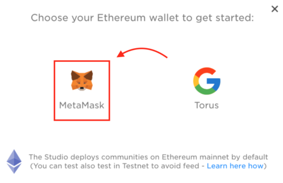

# Community Creation Tutorial

Introducing a step-by-step guide covering the community creation process on Fuse studio. The guide is aimed at teaching you how to __**create a new community from scratch** __and is suitable for users of all levels of technical understanding. 

## Getting Started

**Step 1 -**[ **Download**](https://metamask.io/download.html) ****and install **Metamask.io** to your Chrome, iOS, or Android. Once downloaded, create an account. You can choose between importing an existing account or creating a brand new one. You will be provided with a set of 'seed words' which you can use to login to your account. 


Make sure to save the 'seed words' in the specific order they are shown, ideally on a piece of paper that only you have access to.


**Step 2** **-** Next step will require you to **switch networks** on your Metamask from the Main Ethereum network to Ropsten Test Network.


 Remember, most actions involved with your community and wallet will incur fees which would be quite costly using ETH, so for this reason, we strongly recommend switching to the Ropsten Test Network which uses test ETH balance that’s practically free use to pay for those fees.


**Step 3 -** Now let's **top up your wallet balance** by accessing the[ Ropsten Ethereum Faucet](https://faucet.ropsten.be/). To do so, copy your testnet account address by clicking on Metamask \(see picture below\) and paste it into the faucet, then click the 'send me test Ether' button. 


It may take from 5-30 seconds for the balance to update, so don't worry if it doesn't arrive quickly, simply refresh the page.



Copy your **wallet address**



Paste the **wallet address** in the field and press **send me test Ether**


**Step 4 -** Congratulations! You now have Ropsten ETH to use! Now you can **access** the[ Fuse studio](https://studio.fuse.io/) which you can also navigate to from the main page of the Fuse website. Once there, click on the **'connect wallet'** button, where you can choose to connect with either Metamask \(recommended\) or Torus. Press **connect** and vualá!


Click **connect wallet**



Choose **MetaMask**



Click **connect**


**Step 5 -** To use the studio, you will need to **add** the **Fuse Network Custom RPC** to your Metamask. To do so, click on the Metamask icon in your browser, then **select** network and custom RPC. Type in the following:


* **Network name:** Fuse Network
* **New RPC URL:**[ ****https://rpc.fuse.io](https://rpc.fuse.io)
* **ChainID:** 122
* **Symbol:** FUSE
* **Block Explorer URL:**[ ****https://explorer.fuse.io](https://explorer.fuse.io)


After doing so, **switch** to this new **custom network** on your Metamask.

**Step 6 -** Ready, set, launch! You are ready to **create your own community** on Fuse studio! Simply press the [launch you community](https://studio.fuse.io/view/issuance) ****action button to begin the process:

## Community Creation 

You are now ready to create a community of your own! To do so, simply go through these mini-steps of the process:

**Step 1 -** After clicking the '**launch your community**' button, put in a name and description for your community and add your email address, then click next.

**Step 2 -** Choose the **network** you want to deploy to \(between Ethereum mainnet and Ethereum Ropsten networks\). 


As mentioned earlier, for test purposes, pick Ethereum Ropsten, then click next.


**Step 3 -** Choose between creating a **new token** \(recommended\), or use an **existing token** on Ethereum Ropsten, then click next.

**Step 4 -** Now configure your community by **customizing** the token settings. 


You can choose two different types of supplies for your token. A **Mintable/Burnable** token will allow you to create or burn tokens later on. **One time** issued tokens will have a limited supply that you will set.


This choice will essentially depend on how you wish to make use of these tokens in your community. You will also need to choose an initial supply, currency symbol, community logo, cover photo, and will be able to choose between the following currently available community plugins: 

* **Business list** — allows you to add/delete businesses in your community.
* **Join bonus** — define the amount of token’s gifted to new community members.
* **Invite bonus** — define the amount of token’s gifted to the user’s inviting new community members.
* **Backup bonus** — contract of a funder account that rewards your users for backing up their mnemonic.
* **Fiat ramp** — deposit/withdraw currency with a new feature integrated through ****[**Transak**](https://transak.com/) and ****[**Instant Ramp**](https://instant.ramp.network/) giving you more options to handle the exchange.
* **Wallet banner link** — allows you to insert an image with a link to any webpage which will be shown to all the users of your community.

**Step 5 - Review** and **sign** your community using Metamask. The verification process may take some time, so grab a cup of coffee/tea meantime.

**Step 6 -** Congratulations, you have successfully created your own, one of a kind community!

## Before Using Fuse Studio

These last couple of steps are needed to ensure the proper distribution of community balance and Fuse wallet connectivity.

**Step 7 -** Well done, you are now in full control of your community! Now, you will need to bridge over some of your **Ropsten network balance** to the **Fuse network**, allowing you to have a sufficient enough token balance to begin actions in the studio. 

After doing so, **switch** to the **Fuse network** on your Metamask to be able to perform actions on the Studio.

**Step 8 -** It's been a long road, but you are finally on the last step! To be able to make easy mobile transactions using your community, download the Fuse wallet app on the [App Store](https://apps.apple.com/il/app/fuse-wallet/id1491783654) or [Google Play](https://play.google.com/store/apps/details?id=io.fuse.fusecash). 


You can also type '**Fuse wallet**' in the App Store or Google Play search to find the app.


Sign up using your **phone number** and **name** to create a wallet. On the app, click the top-left option bar and click '**Switch community**'. Then, press '**Scan QR to switch**' and navigate your phone camera to QR code that you can find in the '**White label wallet**' tab in the studio. Share this QR code with your community members so they can join too!


Press '**switch community**' and then '**Scan QR to switch**'



Use your phone camera and navigate it to the QR code


**Step 9:** Congratulations! You are set and done. Begin changing the world one Fuse community at a time!

We hope you have found this article useful and informative, and are now ready to create a community of your own! If you have any other questions regarding the Fuse network, studio, or wallet, don’t hesitate to check out the [FAQ](https://docs.fuse.io/the-fuse-studio/faq). We would love to hear your thoughts and feedback on the project and your communities on [medium](https://medium.com/fusenet), [github](https://github.com/fuseio), [twitter](https://twitter.com/fuse_network), [telegram](https://t.me/fuseio) and [discord](https://discord.com/invite/jpPMeSZ)! Let’s empower communities around the world together with Fuse!

