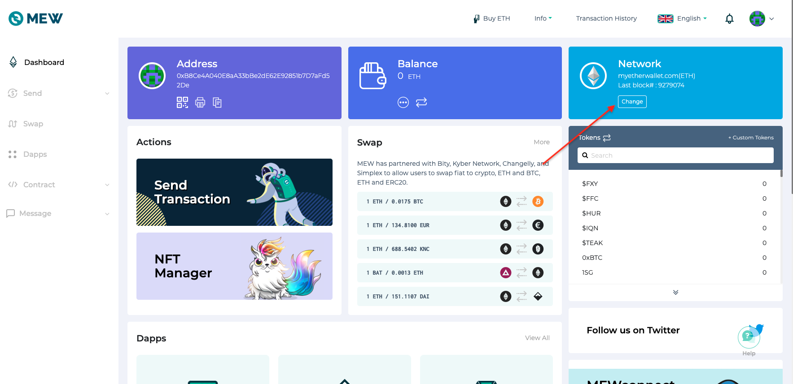
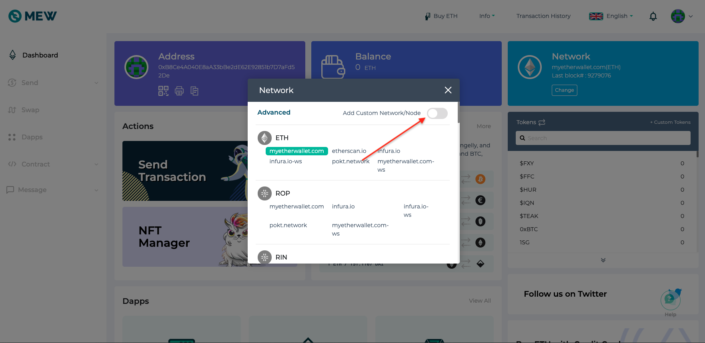
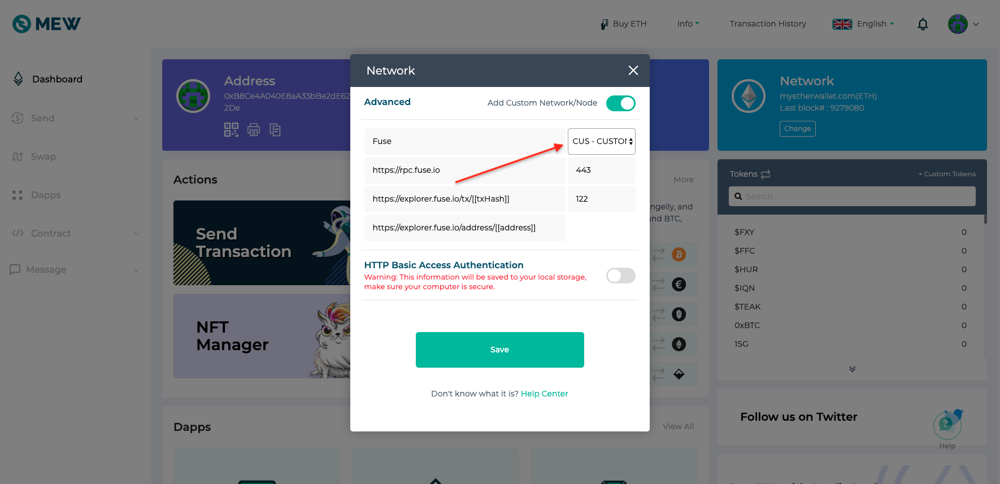

# How to add Fuse Network to MEW

1. To set up Fuse Network on MEW click on "change" under network section at the top right corner.

2. A popup will open. Click on the toggle "Add Custom Network/Node" to turn it on.

3. Select "CUS - CUSTOM" in the dropdown, fill in the details below and click "Save"


ETH Node Name: **Fuse**

URL: **https://rpc.fuse.io**

Port: **443**

Network ID: **122**

Explorer link to transactions: **https://explorer.fuse.io/tx/\[\[txHash\]\]**

Explorer link to addresses: **https://explorer.fuse.io/address/\[\[address\]\]**


4. Now you're connected to Fuse and can use its full features and products.

