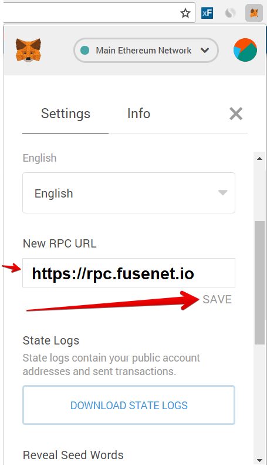

# How to add Fuse Network to your Metamask

1. To set up Fuse as a new network on Metamask. Click on the network selector at the top of the app and then choose "Custom RPC" from the list:     
2. Then in the "New RPC URL" enter this address: **`https://rpc.fusenet.io`**

**\`\`** 

3. Now you can use the Fuse Studio on the Fuse network

